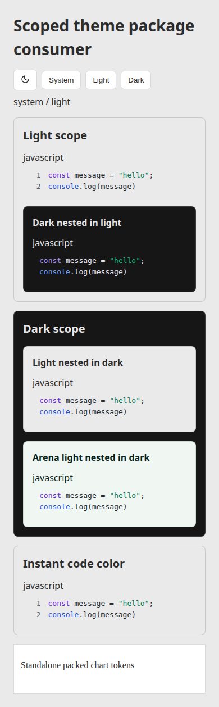
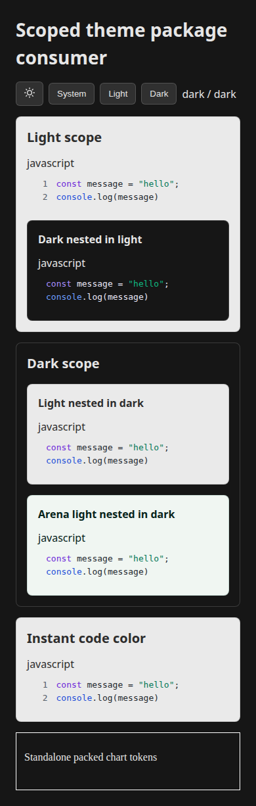

# Scoped theme contract browser proof

These screenshots show a separate Vite app installed from local Brand 1.9.1, UI 11.12.0, and Charts 0.1.13 tarballs built from source revision `9e0a44009e784356798d9fc14abd7c072de6c417`.
The app renders the packed `ThemeToggle`, `CodeBlock`, and standalone chart CSS at a 390 px viewport.
The root mode changes while opposite and named nested scopes retain their own colors.

The browser run passed 29 checks with zero page errors.
It covered storage denial, live system preference changes, SSR hydration, immediate syntax recoloring, and standalone chart light and dark values.
The checked-in [CSS browser fixture](../../../scripts/theme-browser.html) passed 482 assertions in each light and dark/reduced-motion run.
These are local package-consumer checks, not a deployed application claim.
