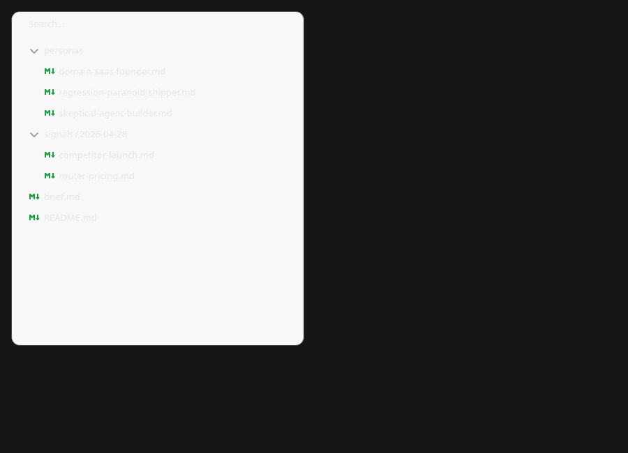
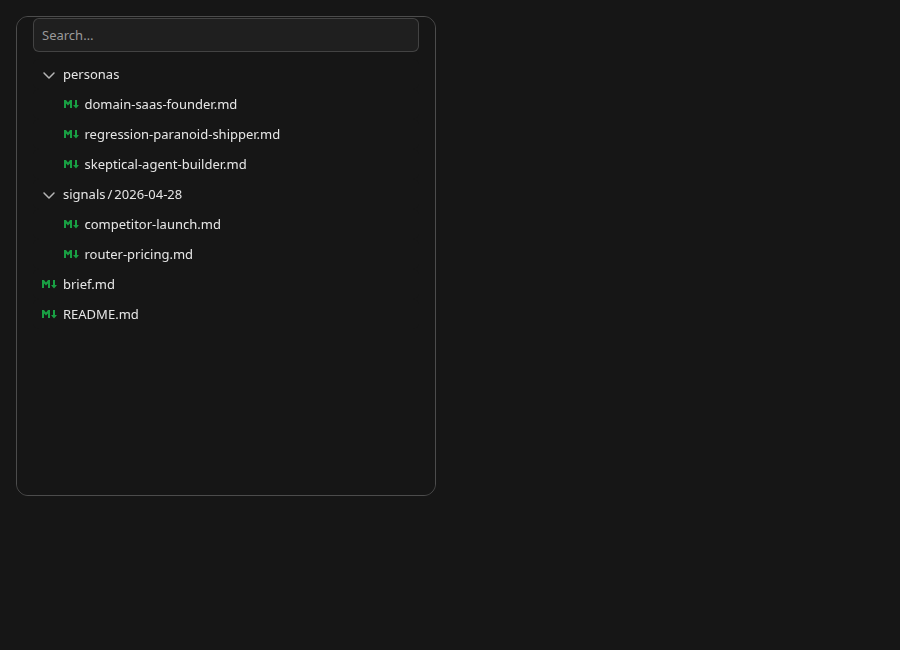
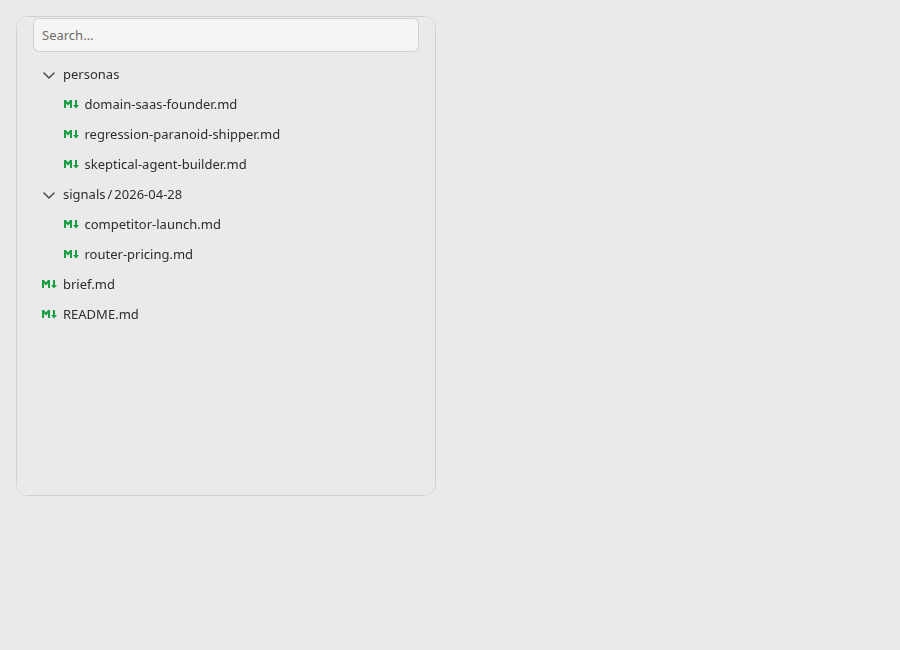
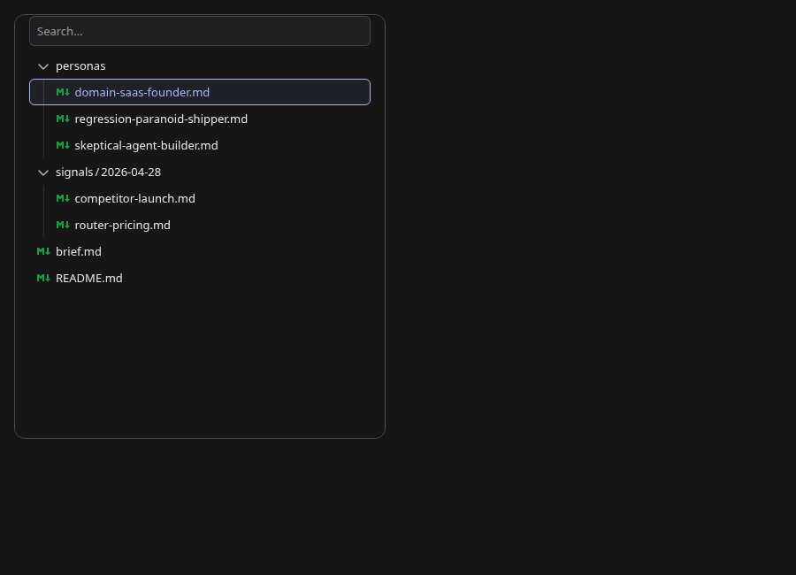
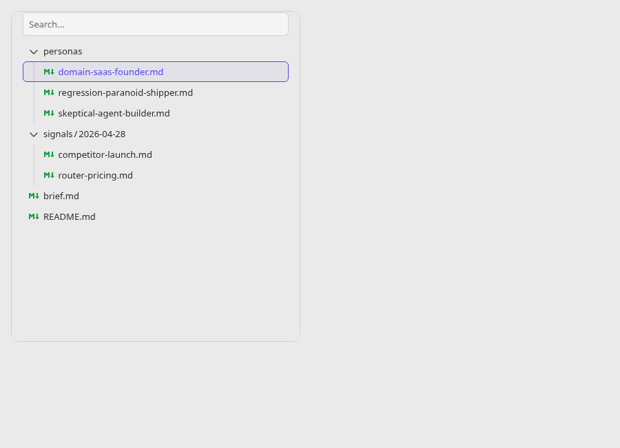
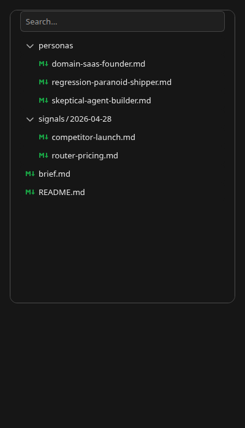

# RichFileTree theme proof

Source: `d317729` on `fix/rich-file-tree-theme-tokens-20261001`.
Target: Storybook 10.6.0 `Files/RichFileTree / Default` in headless Chromium at 900 × 650 px.
The mobile capture uses 400 × 700 px.

The old dark tree used `rgb(248, 248, 248)` for its shadow host and rows on the `rgb(22, 22, 22)` Brand canvas.
The new tree uses the canonical Brand background and text tokens in both themes.

| Theme | Host and row background | Row text | Row contrast | Search background |
| --- | --- | --- | ---: | --- |
| Dark | `rgb(22, 22, 22)` | `rgb(230, 230, 230)` | 14.50:1 | `rgb(31, 31, 31)` |
| Light | `rgb(234, 234, 234)` | `rgb(45, 45, 45)` | 11.45:1 | `rgb(245, 245, 245)` |

The browser probe also checked hover color, selection, the accent focus outline, and search filtering to one file.
The dark mobile preview has no horizontal overflow at 400 px.
A separate Vite consumer installed packed `@tangle-network/ui@11.12.0` and `@tangle-network/brand@1.9.1` tarballs from this worktree.
It imported `@tangle-network/ui/files` and reproduced the same light and dark background, row, and search colors without browser errors.
The tarballs were local; this proof does not claim the fix is published on npm.

| Before | After |
| --- | --- |
|  |  |

