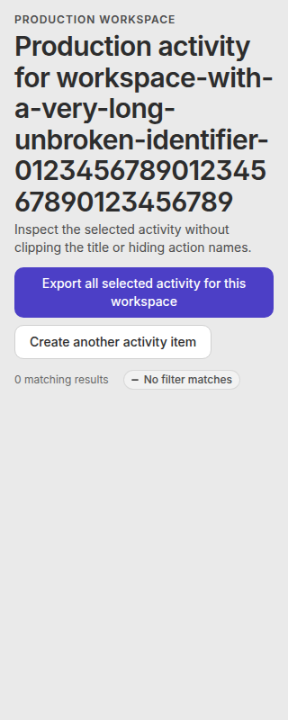
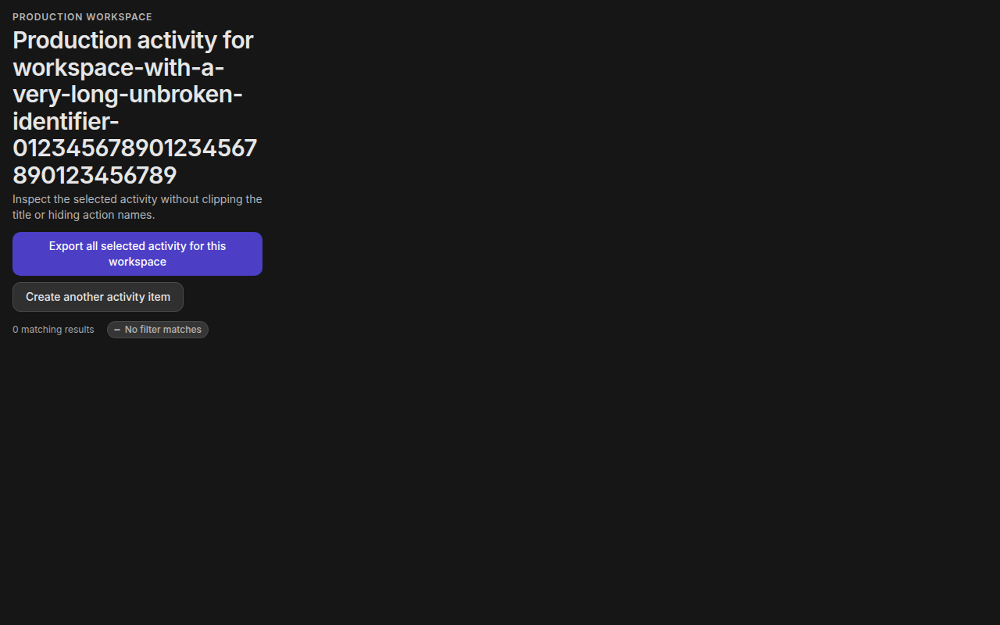
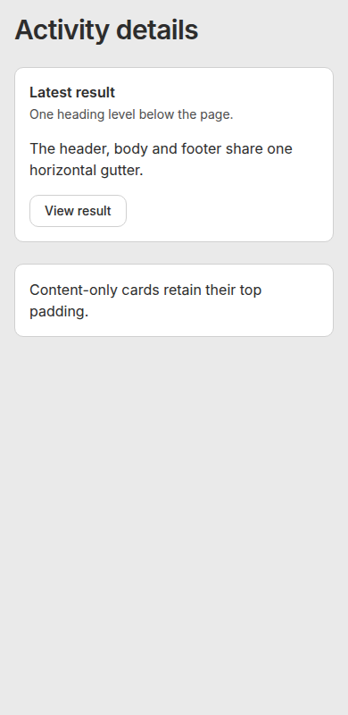
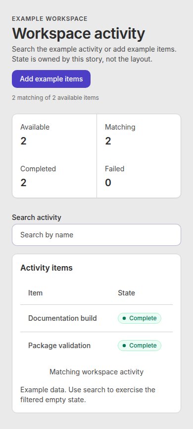
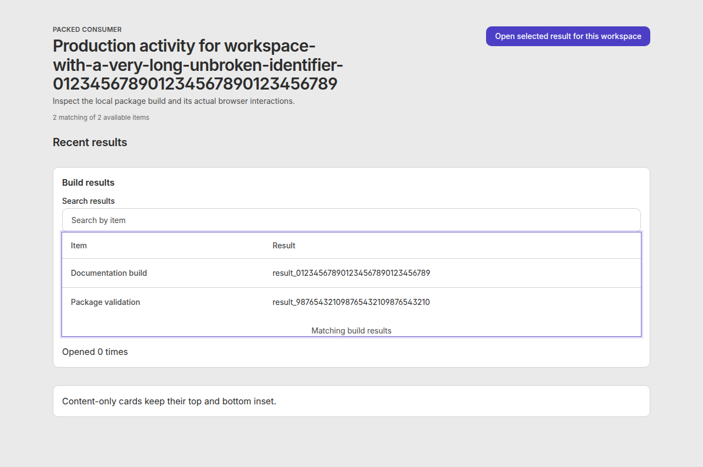

# Shared page presentation browser proof

Source code: `5d4863f2c03f481b2e17914bb692eb2a8e9becab` on `feat/shared-page-presentation-20261001`.
The screenshots came from the built Storybook and a separate Vite app installed from local package tarballs.
Built Storybook ran in GTR Chromium at 320, 390, and 1280 px in both Brand themes, with no page errors.
The browser checked heading order, long title and action wrapping, card spacing, table scroll ownership, and populated, empty, loading, and error states.

The separate Vite app installed locally packed `@tangle-network/ui@11.12.0` and `@tangle-network/brand@1.9.1`.
It built and passed the same heading, card, table, search, and action flows in Chromium at 320, 390, and 1280 px.
The tarballs were local; this proof does not claim package publication or application rollout.

